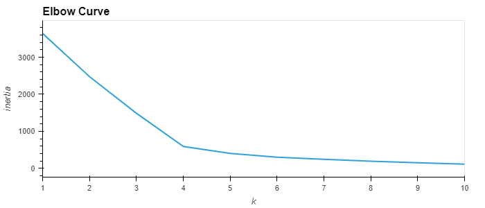
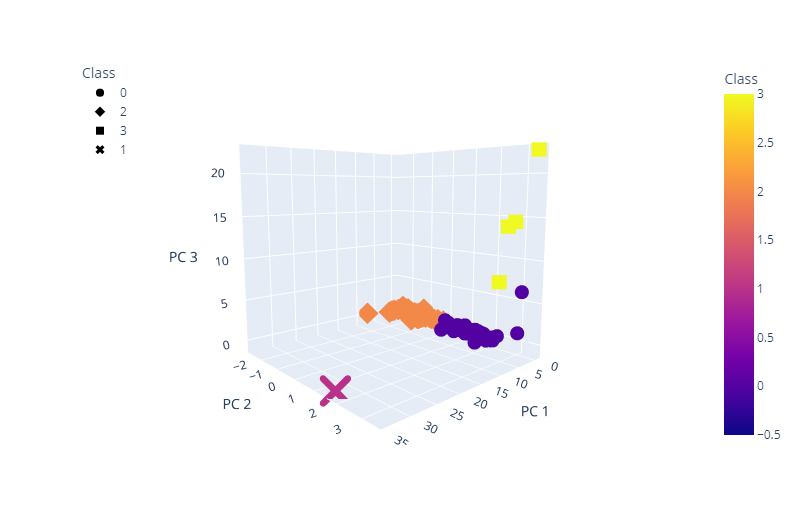
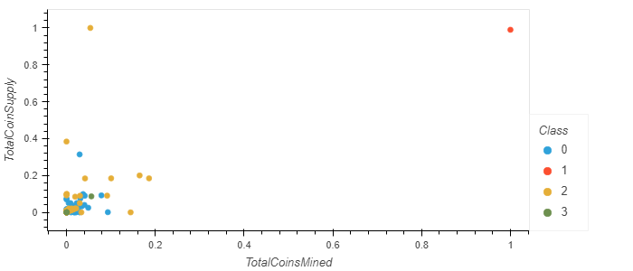

# Unsupervised Machine Learning with Cryptocurrencies
This repository provides provides an example of how to use unsupervised machine learning to analyze cryptocurrency data. The goal is to group different cryptocurrencies into clusters to formulate cryptocurrency investment portfolios. The [Jupyter Notebook](Notebooks/crypto_clustering.ipynb) contains scripts for:
- Preprocessing data
- Reducing data dimensions through PCA
- Clustering cryptocurrencies using K-means
- Visualization of results

The K value for the K-means clustering (i.e. 4) was detemined via visual inspection of an elbow curve generated with the reduced PCA data.

Modeled class assignments were then plotted in a 3D scatter plot.

Finally, data for Total Coin Supply and Total Coins Mined are scaled and plotted on a 2D scatter plot. Points are color-coded by class.

## Resources
- Software:
  - Jupyter Notebook
- Notebooks:
  - [crypto_clustering](Notebooks/crypto_clustering.ipynb)
- Data:
  - [crypto_data.csv](Resources/crypto_data.csv)
    - This csv file was originally retrieved from [CryptoCompare](https://min-api.cryptocompare.com/data/all/coinlist)
